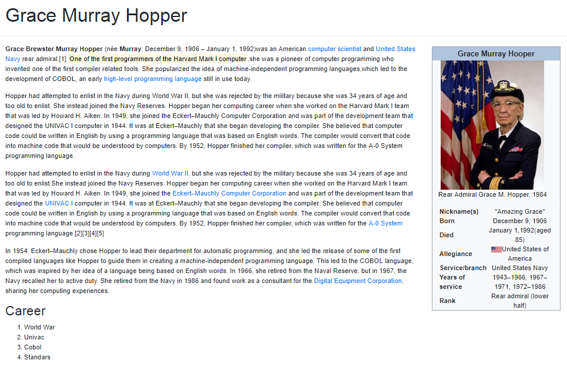

# Grace Hooper React componentes

Esta página contiene un ejercicio sobre el uso de componentes en React tomando como referencia el artículo de Grace Hooper en wikipedia.

## Componentes:

En total se crearon 4 componentes, 3 creados como las etiquetas semanticas que se encontraron y 1 componente que encierra a todos los demás:
 - App
 - Header
 - Main
 - Aside

## Vista

